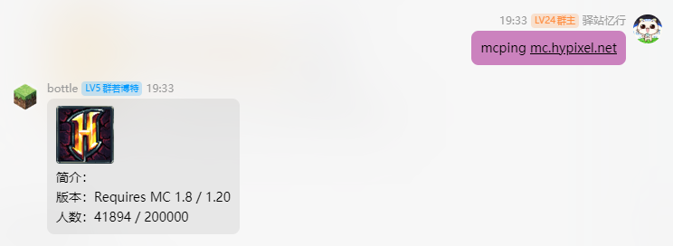
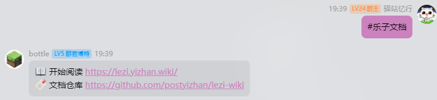

# 笨蛋服务!

这些服务由赛博菩萨和 lilingfeng 搭建，完全免费提供！

目前包括：

- [笨蛋 AI](https://ai.imc.rip) - AI 聊天、文字生成图片
- [笨蛋镜像](https://mirror.imc.rip) - 加速网站访问（为没有 VPN 的用户准备）
- [笨蛋图床](https://image.imc.rip) - 简洁、免费的图床服务
- [笨蛋粘贴板](https://paste.imc.rip) - 上传文件/创建 Paste！（请勿将其当做网盘）
- [笨蛋笔记本](https://notepad.imc.rip) - 免费笔记本，支持密码保护、Markdown 格式和分享功能
- [笨蛋短链](https://imc.rip) - 短链接生成服务

## 规则

**请勿滥用服务，不要上传违法文件！！！**

## 限制

由于使用的 CloudFlare Free Plan 限制，超过一定额度后部分服务可能会停机（目前虽然未频繁遇到此问题）。

### AI

笨蛋 AI 提供一天 1 万次对话，超过后服务将停止。

### Worker

每日请求限制为 10 万次，超过后笨蛋镜像、笨蛋图床、笨蛋粘贴板、笨蛋笔记本、笨蛋短链服务将停止。

### KV

单次文件最大 25 MB，每天限制上传 1000 次和删除 1000 次，超过后笨蛋镜像、笨蛋图床、笨蛋粘贴板、笨蛋笔记本、笨蛋短链的**上传与删除**服务将停止（读取不受影响）。

因此，赞助我吧……（Workers Pro 每月 5 美元，Cloudflare Pro 每月 25 美元）。

# 机器人命令

在群内直接发送消息即可使用机器人指令！



## `mcping`

打印 Minecraft 服务器信息。

**用法：**

```
mcping <服务器地址>
```

## 消息回复

消息回复的关键词需要加前缀 `#`。



以下是可用的关键词：

### `乐子文档`

返回乐子文档的地址和仓库。

### `开服教程`

返回开服教程的地址和仓库。

### `帮助`

返回 [帮助文档](https://yizhan.wiki/NitWikit/%E6%89%A9%E5%B1%95%E9%98%85%E8%AF%BB/%E6%9C%BA%E5%99%A8%E4%BA%BA%E5%91%BD%E4%BB%A4)。

### `正确提问`

提供有关如何正确提问的信息，访问 [正确提问](https://yizhan.wiki/NitWikit/start/%E5%90%91%E5%A4%A7%E4%BD%AC%E6%B1%82%E5%8A%A9)。

### `搜索`

返回 [搜索功能](https://yizhan.wiki/NitWikit/search?q=) 的链接。

### `核心`

返回以下内容：

📦 单端: [服务端核心选择](https://yizhan.wiki/NitWikit/start/%E6%9C%8D%E5%8A%A1%E7%AB%AF%E6%A0%B8%E5%BF%83%E9%80%89%E6%8B%A9)

📦 跨服端: [跨服核心选择](https://yizhan.wiki/NitWikit/%E8%B7%A8%E6%9C%8D%E7%AB%AF/%E6%A0%B8%E5%BF%83%E9%80%89%E6%8B%A9)
