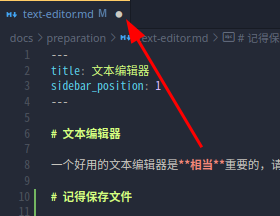
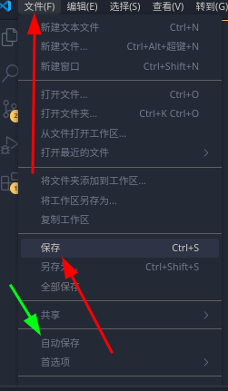
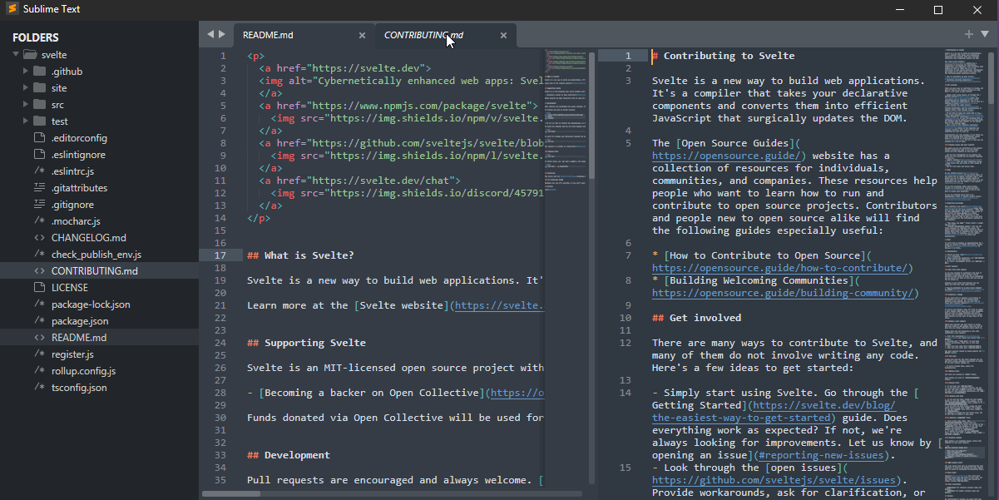
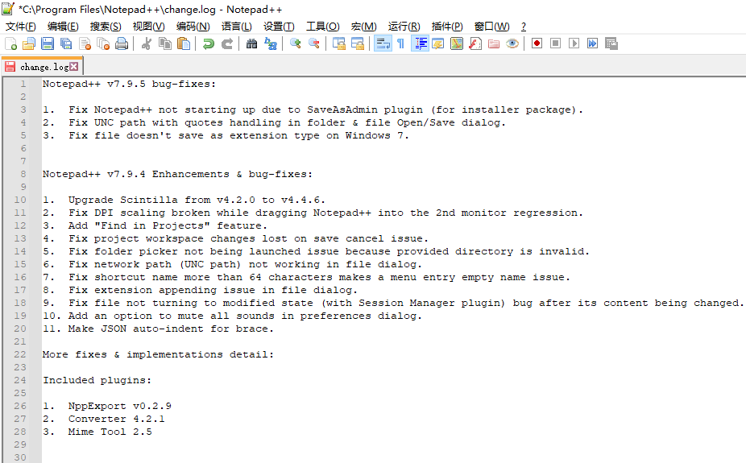
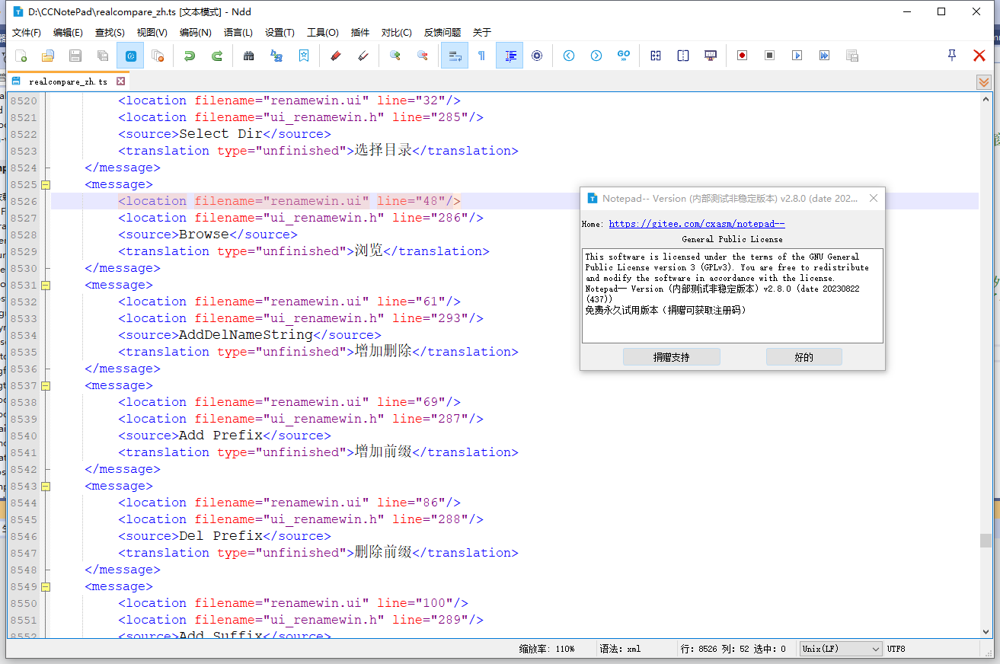
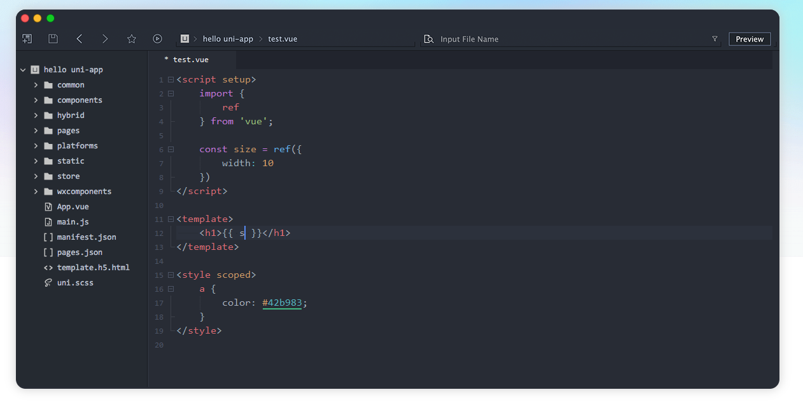

# 文本编辑器

一个好用的文本编辑器是**相当**重要的。本文将介绍几个开服常用的文本编辑器。

:::warning

请不要再使用 Windows 自带的记事本和写字板。这些文本编辑器通常存在以下问题：

1. **文件编码问题**：小白用户在操作时常会造成文件编码改变，导致文件因编码问题无法被服务器读取。

2. **无法察觉格式错误**：有时不小心添加或删除符号可能导致配置文件的语法错误，而记事本无法识别这些格式问题。

3. **缩进识别不足**：这些编辑器默认不使用 [等宽字体](https://baike.baidu.com/item/%E7%AD%89%E5%AE%BD%E5%AD%97%E4%BD%93/8434037) 显示文字，导致显示效果与原格式不符。

4. **缺乏语法高亮功能**：在编辑配置文件时，语法高亮功能可以帮助快速识别配置项及其值，提升效率，而记事本和写字板均不具备此功能。

:::

# 记得保存文件

有些新用户在使用文本编辑器时并不知道编辑完成后需要保存文件。

例如，VSCode 会在未保存的文件名后标记一个白点，提醒你该文件已被编辑但未保存（其他文本编辑器类似）。

- 保存按钮（红色箭头），也可以使用快捷键 `Ctrl + S` 来保存文件。
- 可开启自动保存功能（绿色箭头）。

~~当年 TrMenu 的自动重载治好了我的 autosave~~

## Visual Studio Code

  
点击展开

  

VSCode 是一款全能型文本编辑器，**非常推荐**！它支持简体中文、繁体中文和英文，仅适用于 `Windows 10` 及以上版本。

缺点是启动速度可能稍慢，但非常适合新手使用（已算是较快的选项）。

- 官网链接：[https://code.visualstudio.com/](https://code.visualstudio.com/)

- [下载龟速怎么办](https://cn.bing.com/search?q=vscode%E4%B8%8B%E8%BD%BD%E9%BE%9F%E9%80%9F%E6%80%8E%E4%B9%88%E5%8A%9E)

- [VSCode 视频安装教程](https://www.bilibili.com/video/BV1nM4m117Fv/?share_source=copy_web)

## Sublime Text

  
点击展开

Sublime Text 是一款优秀的文本编辑器，但在保存文件时会对非激活用户弹出支付提示窗口（可以选择不支持）。即便如此，它依然是非常优秀的选择。

- 官网链接：[https://www.sublimetext.com/](https://www.sublimetext.com/)

- [如何汉化](https://cn.bing.com/search?q=sublime+text%e6%b1%89%e5%8c%96&qs=SC&pq=sublimetext&sk=HS1SC5&sc=10-11&cvid=19623440FA3646E0BEBECEED995CFCAF&FORM=QBRE&sp=7&lq=0)

## Kate

  
点击展开

- 官网链接：[https://kate-editor.org/zh-cn/](https://kate-editor.org/zh-cn/)

开源且跨平台，启动快速，加载文件迅速。

## Notepad3

  
点击展开

Notepad3 是一个相对不错的文本编辑器，适用于 **Windows 8 及以上**版本。

- 官网链接：[https://rizonesoft.com/downloads/notepad3/](https://rizonesoft.com/downloads/notepad3/)

- GitHub：[https://github.com/rizonesoft/Notepad3](https://github.com/rizonesoft/Notepad3)

## Notepad++

  
点击展开

Notepad++ 是一款常用的文本编辑器，功能完善。

:::warning

关于作者的政治立场可能引发争议，请保持理性：

Notepad++ 曾被指责为台独，还多次引发争议。更多详细信息请参考相关讨论。

相对而言，可考虑 **Notepad--** 等其他替代品。

:::

- 官网链接：[http://www.notepadplus.com.cn/](http://www.notepadplus.com.cn/)

## Notepad--

  
点击展开

Notepad-- 是国内作者维护的 Notepad++ 替代品。

- [Gitee](https://gitee.com/cxasm/notepad--)
- [GitHub](https://github.com/cxasm/notepad--)

## HbuilderX

  
点击展开

- 官网链接：[https://dcloud.io/hbuilderx.html](https://dcloud.io/hbuilderx.html)

这是一个国产的文本编辑器。

### 关联右键菜单？

可以在“工具 → 设置（Ctrl+Alt+,）”中打开设置，找到“常用配置”手动勾选【关联右键菜单】。

## Geany

  
点击展开

- 官网链接：[https://www.geany.org/](https://www.geany.org/)

**注意**：出于多方面原因，不推荐使用 GitHub 官方出品的 Atom 编辑器，因为它已于 2022 年 12 月由于安全原因宣布停止维护。
