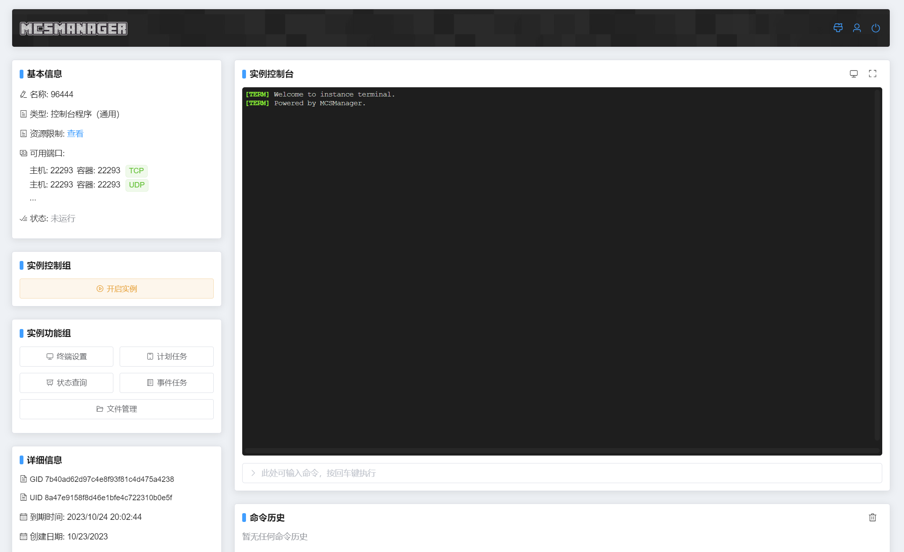
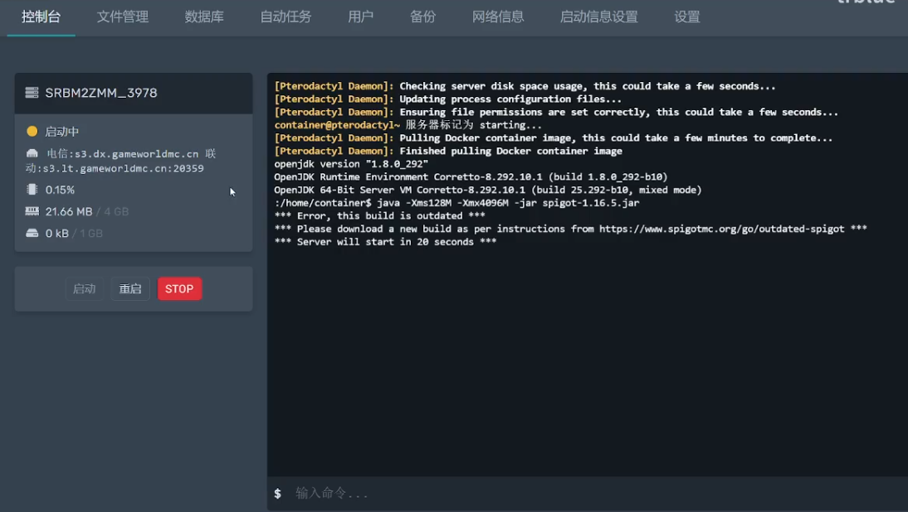

# 可选方式

:::warning

这里所说的 **人话** 只是用于辅助理解，与实际情况可能存在偏差。

:::

建议先阅读 [购置服务器](purchase-server.md)。

## 面板

```
面板是一种相对简单的开服方式，通常提供一键开服等选项，自行配置的内容较少，但使用时会面临不少限制。
```

<details>
<summary> MCSManager 和翼龙面板的外观</summary>

**MCSManager**



**翼龙**



</details>

:::tip

使用面板不一定有坏处，你甚至可以在自己的机器上安装面板进行使用。不过，我们**不推荐**在购置服务器时购买面板。

:::

## VPS

虚拟专用服务器（Virtual Private Server，简称 VPS）是利用虚拟服务器软件（如微软的 Virtual Server、VMware 的 ESX server、SWsoft 的 Virtuozzo）将一台物理服务器分割成多个虚拟专享服务器。每个 VPS 主机都可以配置独立的公网 IP 地址、操作系统、大容量存储、内存和 CPU 资源等，具有独立运行和管理的能力。

简单来说，VPS 相当于**云电脑（云服务器）**。

:::info

虽然可以从大厂（如腾讯云和阿里云）购买服务器，但价格较贵，而且这些大厂并不是专门针对 Minecraft 服务器的。

你可以在一些技术群中找到更便宜的服务器，通常还附带一些服务（如提供付费插件、服务端和驱动的技术咨询等）。

:::

## 家里云

“家里云”是一个幽默的说法，意指将服务器放在自己家里的设备上（用手可以触摸到的设备，所以仅仅是调侃，并不是计算机术语）。实际上，它就是一台你拥有的电脑，可以是你的旧电脑、新购买的、借来的或者是送你的。使用家里云方案时，你需要充分考虑其优缺点，否则可能在运营中造成经济损失。

### 优势：

1. **价格便宜**：可以根据自己的需求选择硬件，若已拥有可以开服的闲置电脑，便可直接使用而不消耗额外资金。
2. **几乎完全可控**：除了网络和电力受到运营商和电力公司的限制外，你可以完全控制其硬件和软件环境。
3. **积累经验**：对于喜欢动手的人来说，搭建并维护服务器的过程会让你获得大量实践经验，提高技术能力。

### 缺点：

1. **初期成本较高**：一台性能不错的服务器可能需要投资数百元到数千元，可能造成经济负担。
2. **不适合短期开服**：若只打算短期使用，购置设备可能造成不必要的浪费。
3. **占用时间**：一旦硬件出现问题，必须亲自处理，可能影响你的时间管理。
4. **运气成分**：服务器依赖于稳定的网络及电力环境，运营商的问题或停电都会影响服务可用性。此外，获取公网 IP 的运气也很重要。

建议在使用家里云方案之前，首先向运营商申请公网 IPv4，并确保条件合格后再选购硬件。

## 独立机

独立机是指将你家的服务器放置在机房（IDC）进行托管。许多机房甚至提供自家电脑供租用。与家里云相比，独立机有以下优点：

1. **专业维护**：机房有技术人员维护，无需你耗费时间。
2. **稳定性**：提供持久的电力和网络保障。
3. **公网 IPv4**：确保获取公网 IP 地址，并可选择更高的上行带宽。

### 缺点：

1. **不够灵活**：对于硬件的增改较为麻烦。
2. **额外费用**：公网 IP、带宽和维护都会产生额外费用，且价格较高。

## 开服器

如 [我的世界开服侠](http://www.kaifuxia.com/) 提供的服务，属于大众化的开服方案。

该方案常常被视为不太理智的选择，因为开服器几乎不需要任何计算机知识，这使得服主显得“懒惰”或“不愿意学习”。虽然经验丰富的服主也可以选择开服器以节约时间，但并不建议依赖此种方式，因为这可能让你失去对计算机知识的探索，形成“思维惰性”。

此外，开服器用户往往存在严重的开服常识不足。
