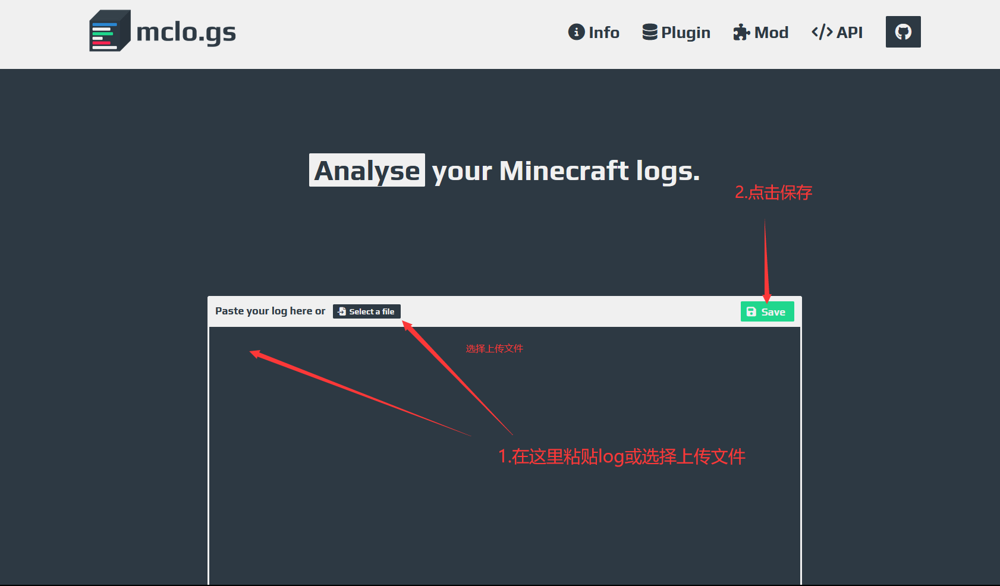
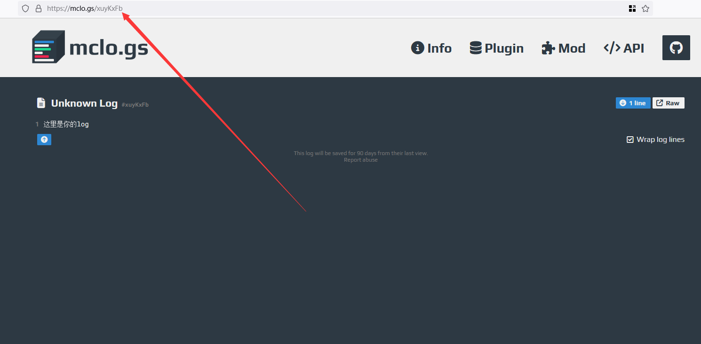

# 如何向大佬求助

首先要明确一点，你是求助者，而不是上级。大多数人还是愿意互帮互助的，但需要注意您的提问方式。

:::warning

在提问之前，请确保你已认真阅读本章内容。有时，无礼和无休止的问题会激怒其他人，可能导致他们对你的服务器进行恶作剧，比如丢假人、报复等。

:::

## 不当提问方式

初入任何领域时，总会遇到问题，但以下这些问题通常不受欢迎：

**`怎么开基岩版互通`**

- 这种问题太直白，建议在求助前稍微调整一下**态度**。

**`什么是 pojav？插件的 wiki 在哪里？`**

- **不要把群和人当作搜索引擎** (除非你愿意支付)。

**`我玩家进不来服务器怎么办`**

- **描述模糊**，可能性太多，以至于其他人无法有所帮助。

**`不正确提供 log 或不提供 log`**

- 如果没有有效的日志，没人能确切知道你的问题所在。
- 在 **服务器问题**中提供 **客户端日志** 是错误的。
- 提供**不完整**的日志，或者干脆 **不提供**日志。
- 错误地将**客户端**收到的报错信息当作**服务端**的错误。
- 不要将成百上千行的日志直接在群聊中发送。

:::warning

请直接查看控制台错误，而不是把截图发到群聊中。

:::

## 正确的提问方式

为了避免不必要的问题，提问时应遵循以下原则：

1. **先查 Wiki 或搜索** - [详细说明](#看完-wiki-再问)

2. **使用礼貌用语**

   - 例如：`请问大佬们，我的 xxx 插件报错 NullPointerException，该怎么办呢？`
   - 使用敬语：`打扰一下，我最近服务器总是报错 The server has not responded for 35 seconds! 请问有人知道怎么回事吗？`

   不应使用：

   - 过于直接的询问：`服务器报错这个 C++ Exception: std::optional<class std::system_error> 是啥情况`
   - 不友好的发言：`你不知道可以不说话，别在这浪费我时间`
   - 指责他人：`你就不会写插件吗，这插件怎么能开服就报错呢`

3. **明确具体问题，选择对应的群咨询**

   - 例如，在某插件与新版不兼容时，可以在“我的世界服主交流群”提问：`请问在升级 paper1.20.4 后，遇到 xxx 插件不兼容应该怎么办？`
   - 提问时确保所提问的内容与群主题相关。

   不应：

   - 在不相关的群提问如 PowerNukkitX 的问题问到 LeviLemina 交流群。

4. **提到服务器环境**

   - 例如：`大佬们我是 1.16.5 catserver 服务器，遇到了 xxx 问题`
   - `最近我升级到了 1.21 paper 核心，玩家反应 xxx，有人有类似的问题吗？`

   不应：

   - 只提供插件名和报错信息而不提服务端版本相关信息。

5. **提供合理的日志** - [详细说明](#给出日志)

## 看完 Wiki 再问

Wiki 旨在帮助你解决常见问题。如果不先查阅而随意提问，结果只会收到 `滚过去看 wiki` 的回应。

几乎所有软件都会附带 Wiki，通常可以在以下位置找到：

- 插件的 README 文件（可以在 GitHub 页面的下方找到）
- 插件作者在社交媒体发布的视频或文档
- 即时通讯软件群内的文档或公告

在遇到问题时，请耐心寻找相关文档，实在找不到说明作者可能没有写，相应情况再询问。

Wiki 中通常有搜索功能。在使用时，务必使用简短关键词，因为搜索工具无法识别近义词。

如果 Wiki 没有搜索功能，可以采用浏览器的搜索功能。在主流浏览器中，Windows 下按 `Ctrl + F`，macOS 下按 `Command + F` 启用搜索。

对于非网站形式的 Wiki 文档，也可以用 `Ctrl + F` 或 `Command + F` 启动搜索。

**最后，只有在认真尝试各种方法后仍找不到答案时，才可以进行提问。**

## 给出日志

### 笨蛋脚本

使用此[脚本](https://github.com/lilingfengdev/NitWiki-Script/releases/download/windows-latest/update-log.exe)，可以将日志自动上传到 mclo.gs（默认上传的日志为 `logs/latest.log`）。

### 如何上传

在询问问题时，请附上报错日志（推荐使用 [Mclogs](https://mclo.gs/) 上传日志）。

你需要明白，无法提供日志的情况下，没人能有效帮你解决问题。

  
如何使用 Mclogs

服务器日志文件通常在服务端根目录的 logs 文件夹，建议上传 latest.log（最新日志）。

把这个链接复制粘贴后发给需要帮助的大佬。

### 其他日志上传网站

  
其他可用的网站

- https://pastes.dev/
- https://paste.fastmirror.net/
- https://n0paste.tk/
- https://www.paste.lv/
- https://nekobin.com/
- https://note.ms/dwlg
- https://paste.gg/
- https://bytebin.lucko.me/
- https://netcut.cn/
- https://cl1p.cn/
- https://jiantieban.cn/
- https://www.verybin.com/
- https://ykjtb.com/
- https://airportal.cn/
- https://toolight.cn/text/paste
- https://nick-running.github.io/easy-tools/clipboard.html

:::warning

请始终遵守以上规则，否则可能会导致你被添加到**乐子文档**中。

:::

**经典如何提问: [停止问问题的愚蠢方式](https://settingdust.gitbook.io/stop-ask-questions-the-stupid-ways/)**

## 经典老图

## 真正的傻逼

对不起大佬，是我疏忽了，没有说明服务器即使未停也会将日志输出到 `latest.log`。
